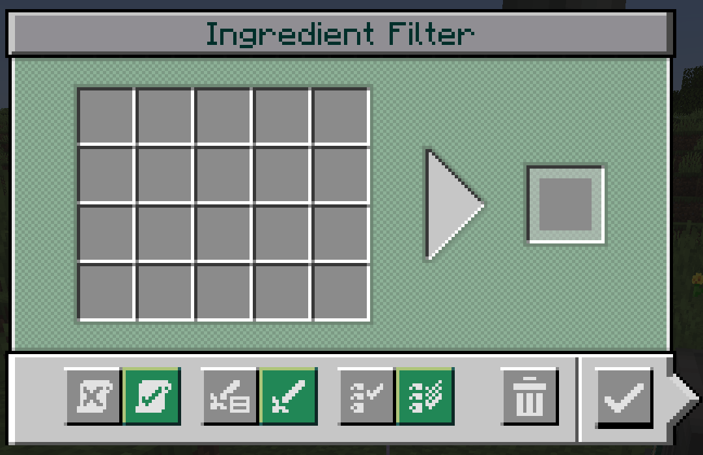
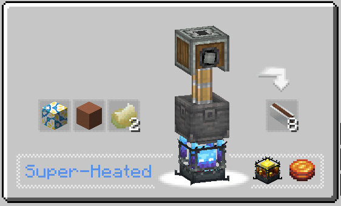
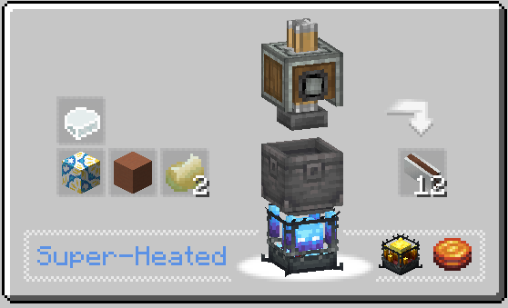
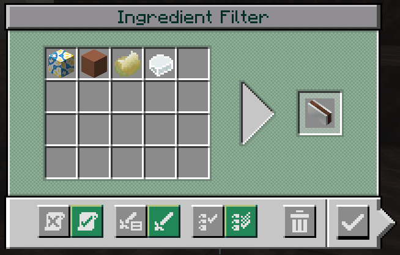
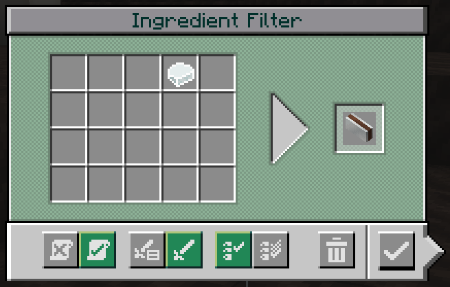
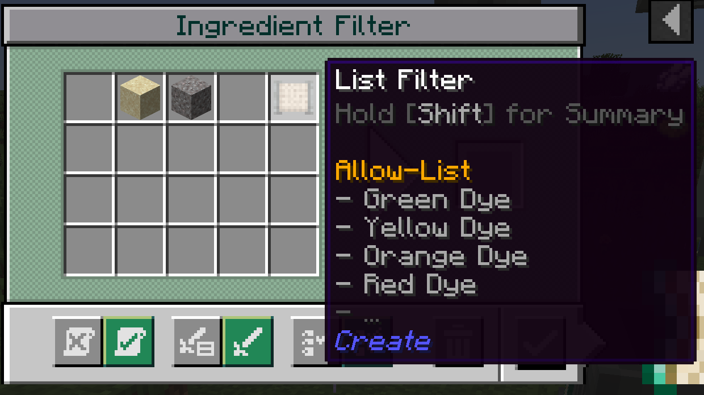

# CreatIF - Create: IngredientFilter

You know those modpacks, where the author tries to be very forthcoming to their playerbase by enabling them to multiply yields of lower tiered recipes by just adding another item?

Good intentions, I like it a lot, prevents having to rebuild parts of the factory when unlocking new recipes.

However, Create seems to not have thought of that at all, basins just pick any recipe matching a subset ingredients. 

## The solution: New filter type!

  

Allows you to specify items that need to be in a basin before it may start on the left.  
You can also use buckets/fluids to require that specific liquids are present.  
Optionally you can specify the target recipe in the slot on the right.

**Supports adding recipes via [+] Button in EMI or JEI!**

### Example: 

A recipe for a modded item has these two variants (check out Compression Modpack):

How is create basin going to determine which one it actually uses? Thats right, the one with less items. This behaviour is hardcoded.

However, with my filter, you can prevent any misunderstandings.

 

Both of the above prevent processing until the 4th ingredient is available.   
Note the rightmost pair of buttons: 
- MatchAny allows processing if any of the ingredients specified in the filter is available.
- MatchAll waits until ALL are available.

You can even nest normal filters, like here for colored concrete powder  

which produces following interactions:
- MatchAny: Expands available inventory (boring)
- MatchAll: Checks any ONE item in the nested filter is available. Like:   
    `OuterFilter[Item1 AND Item2 AND InnerFilter(Item3 OR Item4)]`

NOTE: You cannot nest Ingredient filters!
